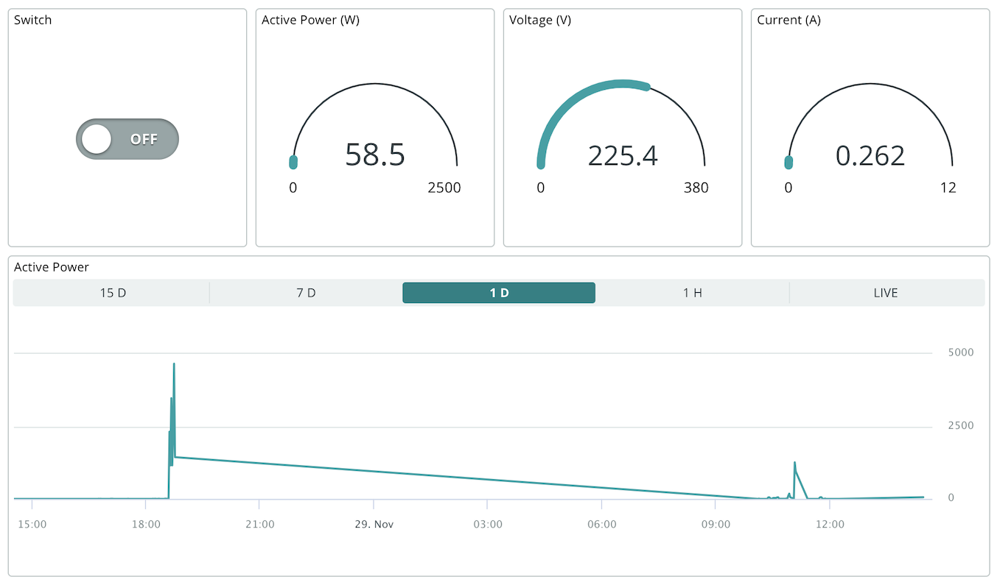
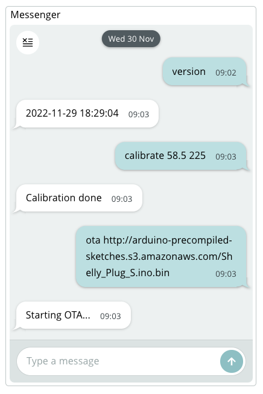

# Arduino firmware for Shelly Plug S 🔌⚡️📈

This firmware is an open-source replacement for the stock firmware of the **[Shelly Plug S](https://www.shelly.cloud/products/shelly-plug-s-smart-home-automation-device/)**.

Features:

* **remote control** (on/off) and **power monitoring**
* integration with [Arduino Cloud](https://cloud.arduino.cc/)
* configuration web portal exposed in access point mode to configure WiFi and Arduino Cloud credentials
* support for built-in physical button (on/off)
* power monitoring calibration
* OTA for firmware update

Roadmap:

* support for the [Scheduler](https://docs.arduino.cc/arduino-cloud/features/cloud-scheduler) widget

This smart plug is particularly interesting because thanks to its factory firmware it can be reflashed wirelessly without any soldering or wiring. Just use this precompiled firmware and you'll be up and running in minutes.



## Getting started

**No soldering or wiring is needed for this!** The following procedure is completely wireless and uses a precompiled binary.

> **Warning** Note: this procedure was tested, but should something go wrong in the OTA process there's the possibility that your device may become bricked (recovery will require the physical procedure described below). Do this at your own risk.

1. Plug the Shelly device into a power socket.
2. Connect your smartphone or PC to the *"shellyplug-s-XXXXXX"* WiFi network
    * Note down the exact network name. You'll use it later.
3. Open [http://192.168.33.1/](http://192.168.33.1/) in a web browser to access the Shelly configuration interface, and navigate to the "Internet & Security" section.
4. Configure your WiFi credentials in the "WIFI MODE - CLIENT" and save.
5. After the Shelly device reboots you'll need to check that it's reachable on your main WiFi network. This time, since it was assigned an IP address dynamicaly, you'll need to figure out that address using one of these methods:
    * Try connecting to [http://shellyplug-s-XXXXXX](http://shellyplug-s-XXXXXX) replacing this with the network name you saw in step 2 (it should be also used as hostname).
    * If it doesn't work, try to run `arp -a` if you're on Mac or Linux to see a list of devices in your network.
    * As last resort, you can open your router interface to see the connected devices their IP addresses.
6. After you checked that the Shelly device connected successfully to your WiFi network and that you know its hostname/IP, it's time to launch the actual OTA. Put the Shelly hostname/IP in this long URL and open it with your web browser:

    ```
    http://shellyplug-s-XXXXXX/ota?url=http://arduino-precompiled-sketches.s3.amazonaws.com/Shelly_Plug_S.mgos.zip
    ```

    The response page should contain `"status":"updating"`. The red LED will blink for a while, then will turn off. Be patient, because your Shelly is rebooting twice.
7. Now that you have installed this Arduino firmware on your Shelly device, connect to the "Arduino-XX:XX:XX:XX:XX" WiFi network exposed by the new firmware.
8. Open [http://192.168.4.1/](http://192.168.4.1/) with your browser and enter the "Configure WiFi" page.
9. Configure WiFi and cloud credentials, then save. If you don't have the cloud credentials, see [this tutorial](https://docs.arduino.cc/arduino-cloud/getting-started/esp-32-cloud#step-1-setting-up-the-device) first.

  <p align="right">
    
  </p>

   The device will restart and it should be magically connected to Arduino Cloud!

10. Configure Arduino Cloud by adding the following variables:
    * `relay` (type: string)
    * `active_power` (type: float)
    * `voltage` (type: float)
    * `current` (type: float)

11. Now create a dashboard and have fun!

## Advanced: remote console



This firmware provides a remote console feature that lets you do some advanced tasks through Arduino Cloud, such as calibration and OTA.

To use it, follow this steps:

1. Add one more variable in Arduino Cloud, called `cmd` (type: string).
2. Add a "Messenger" widget to a dashboard and link it to the `cmd` variable.

That's it! Now you can communicate with your Shelly. Here's an overview of the available commands:

* `version` - Get a build timestamp of the firmware running on your Shelly.
* `ota <URL>` - Retrieve a remote firmware and install it on the Shelly (replace "&lt;URL&gt;" with the actual URL). Note that only HTTP addresses (no HTTPS) are supported.
  * Example: `ota http://myserver/myfirmware.bin`
* `calibrate <P> <V>` – Request automatic power monitoring calibration based on the provided values for active power (P, expressed in Watt) and voltage (V, expressed in Volts).
  * Example: `calibrate 60 220`
  * A third parameter can be provided if you want to also supply current (in Ampere). If this is not provided, C=P/V will be assumed (this is fine if you're testing with purely resistive loads such as lightbulbs).
* `get_power_multiplier`, `get_voltage_multiplier`, `get_current_multiplier` - Get the current calibration parameters.
* `set_power_multiplier <X>`, `set_voltage_multiplier <X>`, `set_current_multiplier <X>` - Set the calibration parameters manually.
* `reset_power_monitoring` - Restore the default calibration parameters.

## Internals & Development

**How does this wireless reflashing work?**

We're providing two precompiled binaries:

* Intermediate firmware: http://arduino-precompiled-sketches.s3.amazonaws.com/Shelly_Plug_S.mgos.zip
* Final firmware: http://arduino-precompiled-sketches.s3.amazonaws.com/Shelly_Plug_S.ino.bin

The intermediate firmware is based on the [mgos-to-tasmota](https://github.com/yaourdt/mgos-to-tasmota) tool, whose only job is to take control of the Shelly and download the final firmware (whose sources are locaetd in this repo). We need such intermediate firmware because in order to be accepted by the Shelly OTA it's written using the same framework used by the Shelly firmware (MongooseOS).

If you want to recompile the intermediate firmware yourself in order to make it point to a different URL for the final firmware, just clone the [mgos-to-tasmota repo](https://github.com/yaourdt/mgos-to-tasmota) and change the mos.yml file with the desired final URL, then compile it with the `mos` tool.

**How can I compile this firmware?**

If you want to make changes or compile it yourself, just compile it as follows:

1. Clone this repository.
2. Install the esp8266 core for Arduino and the following libraries: ArduinoIoTCloud, Button2, WiFiManager.
3. Execute `arduino-cli compile --profile generic`
4. Host the firmware in a publicly accessible HTTP (no HTTPS) server in order to install it via OTA.

If you use the above OTA flashing procedure you don't need to compile this firmware youself as you can rely on the precompiled binary!

**How can I flash this firmware to the Shelly using the USB-serial procedure?**

> This method is mostly useful when testing firmware customizations.

1. Open the device by unscrewing the small screw you'll find on the bottom, then extract the PCB by removing the two additional screws you'll find inside. Be careful not to break the WiFi antenna.
2. Solder pin headers on the five holes. I recommend using male pin headers because female headers might prevent the upper part of the enclosure from being closed correctly.
3. Get a USB-TTL serial adapter and **make sure it's working at 3.3V**. I'm using the one by DSD-TECH but any will work if advertised to work with ESP8266/ESP32.
4. Connect the pins to the serial adapter. See <https://faulty.cloud/blog/shelly-plug-s-pinout> for the pinout.
    * (*Shelly* &rarr; *serial adapter*)
    * `GND` &rarr; `GND`
    * `GPIO0` &rarr; `GND`
    * `3.3V` &rarr; `VCC`
    * `RXD` &rarr; `TXD`
    * `TXD` &rarr; `RXD`
5. Use the Arduino IDE to upload the firmware, selecting "Generic ESP8266 Module" and setting Flash Size to "2MB (FS:none)".
6. Disconnect `GPIO0` from `GND` and reboot the device.
    **Warning:** never plug the Shelly in a 220V socket while it's also connected to your PC.

**How to restore the original Shelly firmware?**

1. Get the original firmware from [this site](http://archive.shelly-tools.de).
2. Convert it to a full image using [this tool](https://github.com/ioprev/shelly-firmware).
3. Connect your Shelly device via USB and upload it using:

    ```bash
    arduino-cli upload -i fw.bin --fqbn esp8266:esp8266:generic -p /dev/cu.usbserial-AQ027S3I
    ```

## Credits & license

This firmware was written by Alessandro Ranellucci and is licensed under the terms of the GNU General Public License v3 or later.

It is based on the following components:

* [WiFiManager](https://github.com/tzapu/WiFiManager) by tzapu and many more
* [Button2](https://github.com/LennartHennigs/Button2) by Lennart Hennings
* [HLW8012](https://github.com/xoseperez/hlw8012) by Xose Pérez, patched by Gijs Noorlander
* [ArduinoIoTCloud](https://github.com/arduino-libraries/ArduinoIoTCloud) by the Arduino team
